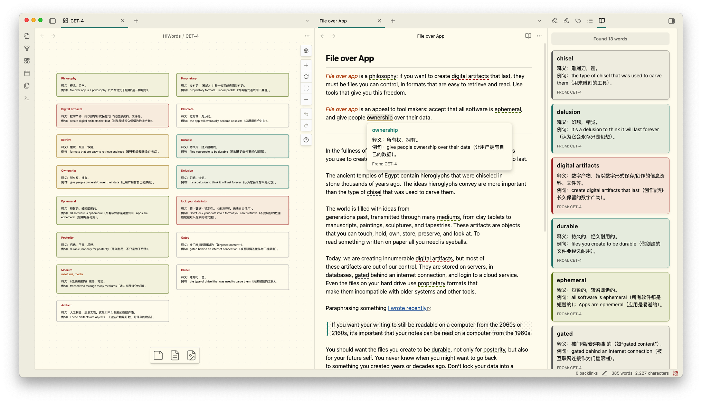
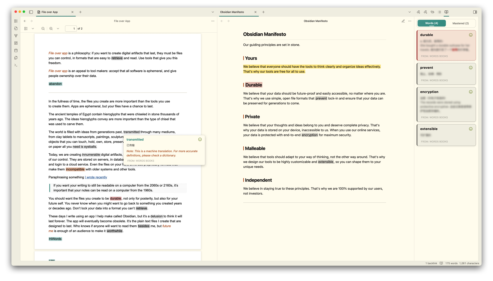
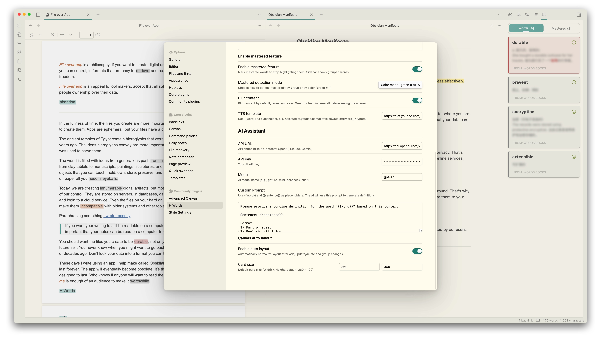
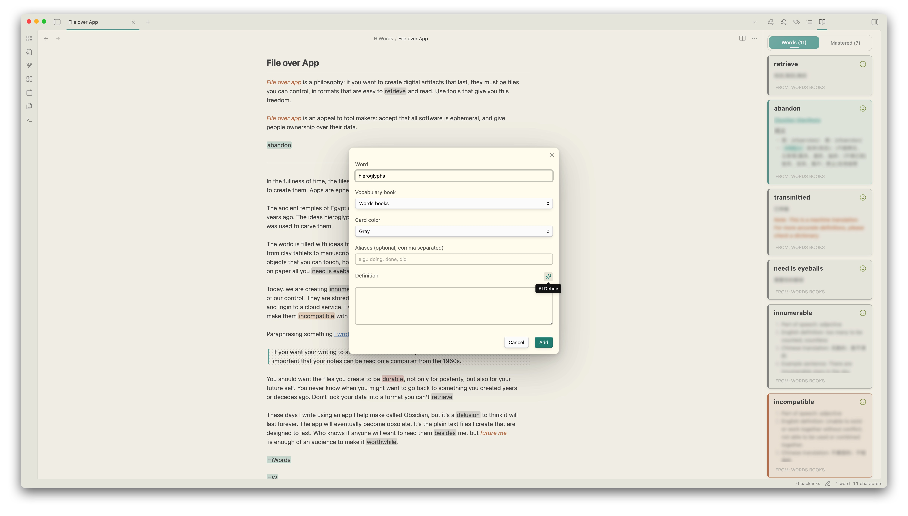

<div align="center">
	<h1>HiWords - Smart Vocabulary Manager for Obsidian</h1>
	
	
	
	
	
</div>

---

[简体中文](./README-ZH.md) | English

An intelligent Obsidian plugin that transforms your reading into an immersive vocabulary learning experience. HiWords automatically highlights unfamiliar words from your custom vocabulary books, provides instant definitions on hover, and helps you master new words effortlessly while reading.



---

## 📚 Canvas-Based Vocabulary Management

Manage your vocabulary books using Obsidian's powerful Canvas feature. You can freely arrange vocabulary cards on Canvas with drag-and-drop, create multiple independent vocabulary books for different topics, languages, or learning goals, and use node colors to categorize words by difficulty, topic, or mastery level. All changes to your vocabulary books are automatically synced and reflected in your reading highlights.


---

## 🎯 Smart Highlighting System

HiWords intelligently highlights vocabulary words in your notes, making it easy to spot and review words you're learning. It instantly recognizes and highlights words from your vocabulary books as you read, with highlight colors matching your Canvas node colors for visual consistency. You can flexibly choose to highlight in all files, specific folders, or exclude certain paths. Built on CodeMirror 6 for smooth performance even with large documents.

Supports not only editing mode but also perfectly supports Markdown reading mode and PDF file highlighting, providing a consistent learning experience across all reading scenarios.



---

## 💡 Instant Definitions on Hover

Simply hover over any highlighted word to instantly view detailed definitions with Markdown formatting support, without leaving your current document. You can mark words as mastered directly in the popup, click the word to hear pronunciation (supports custom TTS services, defaults to English pronunciation), and the popup interface seamlessly adapts to your Obsidian theme for a consistent visual experience.

---

## 🤖 AI-Powered Definitions

Configure your preferred AI service (supports OpenAI, Anthropic, and other compatible formats) to let AI automatically generate contextual definitions. You can customize prompt templates using `{{word}}` and `{{sentence}}` variables, quickly generate AI definitions when adding new words, helping you better understand words in specific contexts.



---

## 📋 Sidebar Vocabulary View

Open the sidebar with a quick command to track your vocabulary learning and see all words in the current document at a glance. Click any word to hear pronunciation, with colors matching Canvas node colors. You can toggle mastered words visibility to focus on active learning, and the list automatically updates in real-time as you edit or switch documents.

---

## ⚡ Quick Word Management

Select any text and right-click to quickly add it to your vocabulary book, or use `Ctrl/Cmd+P` to add selected words via the command palette. The plugin intelligently detects if a word already exists and automatically switches to edit mode, capturing surrounding sentences for better context when adding. Supports efficient management of multiple words across different vocabulary books.



---

## 🚀 Getting Started

### Installation

**From Obsidian Community Plugins (Recommended)**

1. Open Obsidian Settings → Community Plugins
2. Search for "HiWords"
3. Click Install, then Enable

### Creating Your First Vocabulary Book

1. **Create a Canvas file**

   - Right-click in file explorer → New Canvas
   - Name it (e.g., `English Vocabulary.canvas`)

2. **Add vocabulary cards**

   - Create text nodes with this format:

   ```
   
   serendipity
   *serendipitous, serendipitously*
   
   **n.** The ability to make fortunate discoveries by accident
   
   **Example:** The discovery of penicillin was a fortunate serendipity.
   
   ```

3. **Organize with colors**

   - Click nodes to set card colors
   - Use colors to categorize by difficulty, topic, or mastery

4. **Link to HiWords**

   - Open HiWords settings
   - Add your Canvas file as a vocabulary book
   - Start reading and watch words highlight automatically!

> **Tips**: You can directly drag files into Canvas, and HiWords will automatically parse the file content and add it to your vocabulary book. Configure file node mode in HiWords settings to choose filename only or with aliases.

---

## ⚙️ Configuration

### Highlighting Settings

- **Enable Auto Highlighting**: Toggle automatic word highlighting
- **Highlight Style**: Choose highlight display style, supports background highlight, underline, bold, and more
- **Highlight Scope**: All files (default), only specific folders, or exclude specific folders

### Hover Popup Settings

- **Show on Hover**: Enable/disable definition popups
- **Blur Definitions**: Blur definitions until you hover (for active recall practice)
- **TTS Template**: Customize pronunciation service URL

### AI Assistant Settings

- **API URL**: Your AI service endpoint
- **API Key**: Authentication key for AI service
- **Model**: AI model to use (e.g., gpt-4o-mini)
- **Custom Prompt**: Design your prompt with `{{word}}` and `{{sentence}}` placeholders

### Canvas Settings

- **Auto Layout**: Automatically arrange new vocabulary cards
- **Card Size**: Set default width and height for vocabulary cards
- **File Node Mode**: Choose how to parse file nodes (filename only or with aliases)

### Mastery Tracking

- **Enable Mastery Feature**: Track which words you've mastered
- **Show Mastered in Sidebar**: Display or hide mastered words in the sidebar view

---

## 🎯 Usage Tips

### Organizing Vocabulary Books

- **By Language**: Create separate books for different languages
- **By Topic**: Organize words by subject (business, academic, casual, etc.)
- **By Source**: Keep words from different books or courses separate
- **By Difficulty**: Use colors to mark beginner, intermediate, and advanced words

### Effective Learning Workflow

1. **Read naturally** - Let HiWords highlight words automatically
2. **Hover to review** - Check definitions without breaking flow
3. **Mark mastered** - Track your progress as you learn
4. **Add new words** - Right-click or use quick commands to add unfamiliar words
5. **Use AI assistance** - Generate contextual definitions for better understanding

---

## 📝 Commands

Access these commands via `Ctrl/Cmd+P`:

- **Refresh Vocabulary** - Reload all vocabulary books
- **Show Vocabulary Sidebar** - Open the sidebar view
- **Add Selected Word** - Add selected text to vocabulary

---

## 🔒 Privacy & Security

HiWords is privacy-focused: all vocabulary data is stored locally in your vault, and the plugin works completely offline by default with no telemetry. The optional AI dictionary feature (disabled by default) sends words and sentences directly to your configured AI provider only when you manually use the auto-fill button.

---

## 🤝 Support

If you find HiWords helpful, please consider supporting its development:

- [☕ Buy me a coffee on Ko-fi](https://ko-fi.com/catmuse)
- [⭐ Star the project on GitHub](https://github.com/CatMuse/HiWords)
- [🐛 Report issues or suggest features](https://github.com/CatMuse/HiWords/issues)

---

## 📄 License

MIT License - feel free to use and modify as needed.

---

**Made with ❤️ by [CatMuse](https://github.com/CatMuse)**
