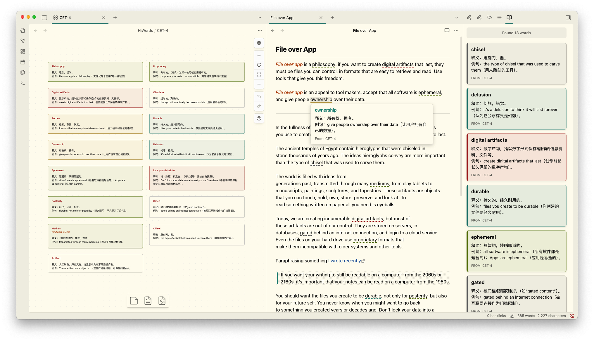
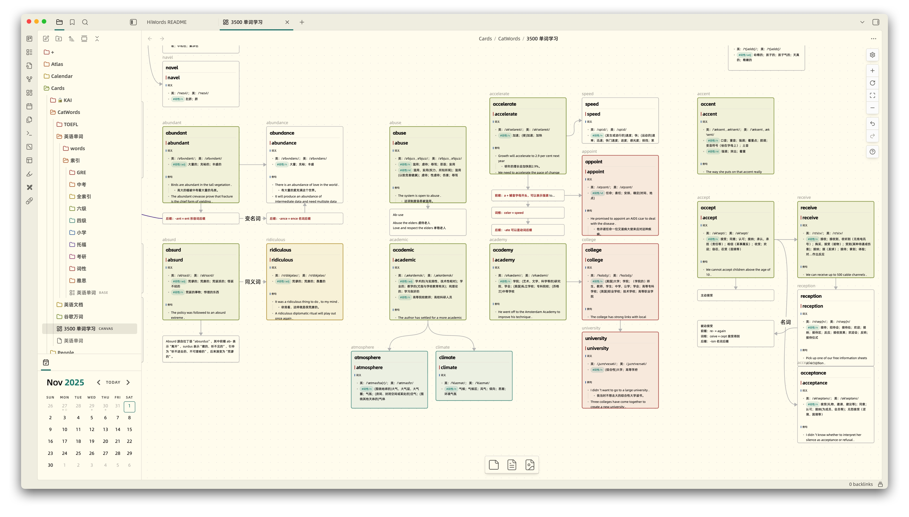
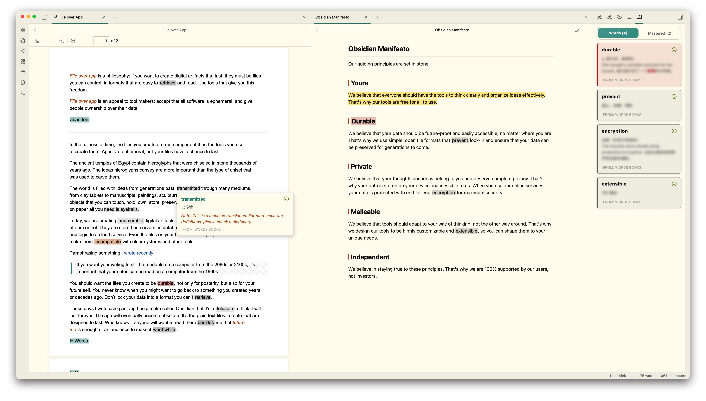
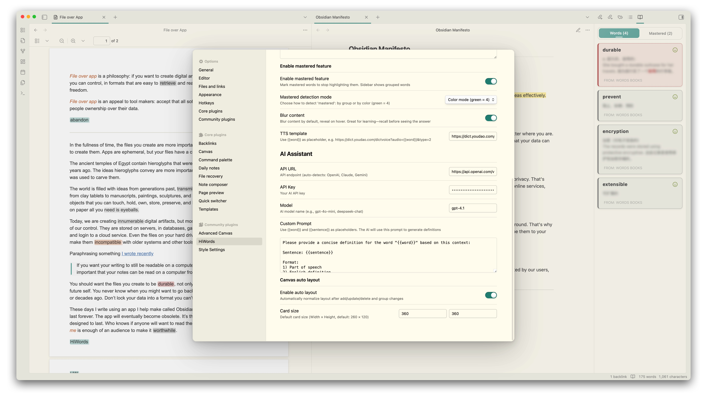
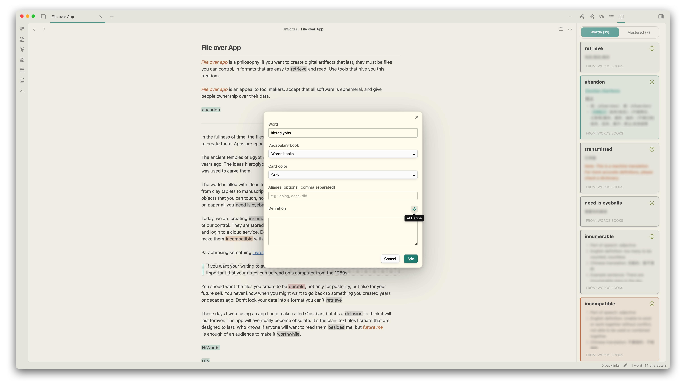

<div align="center">
	<h1>HiWords - Smart Vocabulary Manager for Obsidian</h1>
	
	
	
	
	
</div>

---

[简体中文](./README-ZH.md) | English

An intelligent Obsidian plugin that transforms your reading into an immersive vocabulary learning experience. HiWords automatically highlights unfamiliar words from your custom vocabulary books, provides instant definitions on hover, and helps you master new words effortlessly while reading.



---

The add-word dialog accepts enabled Canvas books and valid word-type `.hiwords` books. Person, concept, custom-type, and invalid files are excluded. For `.hiwords`, words, aliases, and definitions are saved using the existing card format; colors follow the book display settings. Duplicate words are rejected without replacing existing cards.

## 📚 Canvas-Based Vocabulary Management

Manage your vocabulary books using Obsidian's powerful Canvas feature. You can freely arrange vocabulary cards on Canvas with drag-and-drop, create multiple independent vocabulary books for different topics, languages, or learning goals, and use node colors to categorize words by difficulty, topic, or mastery level. All changes to your vocabulary books are automatically synced and reflected in your reading highlights.



---

## Web page vocabulary highlighting

Enable the **Web viewer** core plugin on desktop, then turn on **Settings → HiWords → Highlighting and display → Web page highlighting**, with **Enable auto highlight** also on. Web highlighting is off by default. Once enabled, it processes existing and newly opened HTTP/HTTPS pages in Web viewer.

- Uses your vocabulary, aliases, colors, and mastery filtering. Vault folder inclusion/exclusion rules do not apply to web pages.
- Handles ordinary page text, dynamically added text, navigation, reloads, and vocabulary updates. Work is batched locally without changing the page's text nodes.
- Supports underline, dotted, wavy, and background styles. Bold falls back to a background on web pages.
- Opening the HiWords sidebar while browsing a page lists all matched vocabulary in the loaded page text, deduplicated across occurrences and aliases, with learning/mastered tabs. Dynamic content and page changes update the list. Clicking a highlighted word expands its card within the full list. Click the sidebar word to hear pronunciation, or mark/unmark it as mastered to update webpage highlights. Normal links keep their navigation; use Alt / Option + click to inspect highlighted words inside links. Switching web tabs or navigating replaces the previous page list. With web highlighting enabled, an open sidebar continues collecting words even when auto highlighting is off. Only text already loaded into the page is included; content loaded later appears as it arrives. Hover over a highlighted word to use the same definition popover as notes, including its sections, pronunciation, mastery, notes, sentences, and vault context. When selection translate is enabled, selecting up to 500 characters automatically opens the existing translation popover and translates using your configured AI service and target language. Its add-to-vocabulary action carries the selected context and translation into the existing editor. Reader view, Canvas web cards, mobile, nested iframes, Shadow DOM, and image text are not supported.
- Skips code, form controls, editable regions, and hidden content. Matching is per text node, so words/phrases split across markup are not matched. Individual text nodes over 200,000 characters are skipped.

Privacy: automatic highlighting and hover definitions stay local. With selection translate enabled, selecting text automatically sends the selected text (with your configured prompt/target language) to your configured AI provider. Surrounding page context is not sent by this translation action. Nothing is saved to the vault until you confirm the vocabulary editor. Pages receive only matching ranges and colors for their own text, plus opaque local word tokens, not the full vocabulary, definitions, file paths, or keys. Sidebar pronunciation uses your existing TTS service only when you click the pronunciation control. Turning off web highlighting, auto highlighting, or the plugin removes its page highlights and observers.

This feature depends on the desktop Web viewer's internal web container and Chromium's CSS Custom Highlight API. Unsupported versions are skipped.

---

## 🎯 Smart Highlighting System

HiWords intelligently highlights vocabulary words in your notes, making it easy to spot and review words you're learning. It instantly recognizes and highlights words from your vocabulary books as you read, with highlight colors matching your Canvas node colors for visual consistency. You can flexibly choose to highlight in all files, specific folders, or exclude certain paths. Built on CodeMirror 6 for smooth performance even with large documents.

Supports not only editing mode but also perfectly supports Markdown reading mode and PDF file highlighting, providing a consistent learning experience across all reading scenarios.



---

## 💡 Instant Definitions on Hover

Simply hover over any highlighted word to instantly view detailed definitions with Markdown formatting support, without leaving your current document. You can mark words as mastered directly in the popup, click the word to hear pronunciation (supports custom TTS services, defaults to English pronunciation), and the popup interface seamlessly adapts to your Obsidian theme for a consistent visual experience.

---

## 🤖 AI-Powered Definitions

Configure your preferred AI service (supports OpenAI, Anthropic, and other compatible formats) to let AI automatically generate contextual definitions. You can customize prompt templates using `{{word}}` and `{{sentence}}` variables, quickly generate AI definitions when adding new words, helping you better understand words in specific contexts.



---

## 📋 Sidebar Vocabulary View

Open the sidebar with a quick command to track your vocabulary learning and see all words in the current document at a glance. Click any word to hear pronunciation, with colors matching Canvas node colors. You can toggle mastered words visibility to focus on active learning, and the list automatically updates in real-time as you edit or switch documents.

---

## ⚡ Quick Word Management

Select any text and right-click to quickly add it to your vocabulary book, or use `Ctrl/Cmd+P` to add selected words via the command palette. The plugin intelligently detects if a word already exists and automatically switches to edit mode, capturing surrounding sentences for better context when adding. Supports efficient management of multiple words across different vocabulary books.



---

## 🚀 Getting Started

### Installation

**From Obsidian Community Plugins (Recommended)**

1. Open Obsidian Settings → Community Plugins
2. Search for "HiWords"
3. Click Install, then Enable

### Creating Your First Vocabulary Book

1. **Create a Canvas file**

   - Right-click in file explorer → New Canvas
   - Name it (e.g., `English Vocabulary.canvas`)

2. **Add vocabulary cards**

   - Create text nodes with this format:

   ```
   
   serendipity
   *serendipitous, serendipitously*
   
   **n.** The ability to make fortunate discoveries by accident
   
   **Example:** The discovery of penicillin was a fortunate serendipity.
   
   ```

3. **Organize with colors**

   - Click nodes to set card colors
   - Use colors to categorize by difficulty, topic, or mastery

4. **Link to HiWords**

   - Open HiWords settings
   - Add your Canvas file as a vocabulary book
   - Start reading and watch words highlight automatically!

> **Tips**: You can directly drag files into Canvas, and HiWords will automatically parse the file content and add it to your vocabulary book. Configure file node mode in HiWords settings to choose filename only or with aliases.

---

## ⚙️ Configuration

### Highlighting Settings

- **Enable Auto Highlighting**: Toggle automatic word highlighting
- **Highlight Style**: Choose highlight display style, supports background highlight, underline, bold, and more
- **Highlight Scope**: All files (default), only specific folders, or exclude specific folders

### Hover Popup Settings

- **Show on Hover**: Enable/disable definition popups
- **Blur Definitions**: Blur definitions until you hover (for active recall practice)
- **TTS Template**: Customize pronunciation service URL

### AI Assistant Settings

- **API URL**: Your AI service endpoint
- **API Key**: Select an authentication key stored in Obsidian SecretStorage (Obsidian 1.13.0 or newer). HiWords stores only the secret ID in its settings. Legacy plaintext keys are removed on upgrade; select a secret again to resume AI features.
- **Model**: AI model to use (e.g., gpt-4o-mini)
- **Custom Prompt**: Design your prompt with `{{word}}` and `{{sentence}}` placeholders

### Canvas Settings

- **Auto Layout**: Automatically arrange new vocabulary cards
- **Card Size**: Set default width and height for vocabulary cards
- **File Node Mode**: Choose how to parse file nodes (filename only or with aliases)

### Mastery Tracking

- **Enable Mastery Feature**: Track which words you've mastered
- **Show Mastered in Sidebar**: Display or hide mastered words in the sidebar view

---

## 🎯 Usage Tips

### Organizing Vocabulary Books

- **By Language**: Create separate books for different languages
- **By Topic**: Organize words by subject (business, academic, casual, etc.)
- **By Source**: Keep words from different books or courses separate
- **By Difficulty**: Use colors to mark beginner, intermediate, and advanced words

### Effective Learning Workflow

1. **Read naturally** - Let HiWords highlight words automatically
2. **Hover to review** - Check definitions without breaking flow
3. **Mark mastered** - Track your progress as you learn
4. **Add new words** - Right-click or use quick commands to add unfamiliar words
5. **Use AI assistance** - Generate contextual definitions for better understanding

---

## 📝 Commands

Access these commands via `Ctrl/Cmd+P`:

- **Refresh Vocabulary** - Reload all vocabulary books
- **Show Vocabulary Sidebar** - Open the sidebar view
- **Add Selected Word** - Add selected text to vocabulary

---

## 🔒 Privacy & Security

Vocabulary data and vault-context searches stay in your vault, with no telemetry. AI features require a configured provider and key. Requesting a definition sends the word and any supplied sentence; generating a card draft sends its title; using selection translation sends the selected text to your configured AI provider. Provider data-retention policies apply to these requests. Review AI drafts before applying them.

Playing pronunciation sends the word to the configured TTS service (Youdao by default). Cards with remote image URLs load those images from their hosts when displayed.

---

## 🤝 Support

If you find HiWords helpful, please consider supporting its development:

- [☕ Buy me a coffee on Ko-fi](https://ko-fi.com/catmuse)
- [⭐ Star the project on GitHub](https://github.com/CatMuse/HiWords)
- [🐛 Report issues or suggest features](https://github.com/CatMuse/HiWords/issues)

---

## 📄 License

MIT License - feel free to use and modify as needed.

---

**Made with ❤️ by [CatMuse](https://github.com/CatMuse)**

### Offline dictionary lookup (.hidict)

Place a `.hidict` v1 dictionary (plain JSON or gzip-compressed, with the same `.hidict` extension) inside your vault, then select it under **Settings → HiWords → Word books → Offline dictionary**. Select an English word to see grouped meanings, phonetics and a five-level frequency indicator. Inflections appear as a compact slash-separated list; phonetics follow the accent selected in settings. The add button uses the existing vocabulary-book flow and prefills the headword, definition and selection context. Dictionary entries do not automatically become highlighted words.

Local lookup works without AI. Unknown words and sentence selections use the existing AI translation only when selection translation is enabled; only selected text is sent to your configured provider. Missing or invalid dictionaries show an error without automatically falling back to AI. After moving a dictionary, select its new location in settings. Dictionary editing is not included. See [HiDict format](docs/hidict-format.md).

Dictionary lookup and learning previews share the same card shell and positioning. Dictionary cards show an add-to-vocabulary action; learning previews retain their existing mastery, details, notes, sentence and context actions. Click the dictionary word title to play the preferred accent configured in settings. Pronunciation uses the existing TTS template (Youdao by default), requires a network connection for the default service, and sends only the chosen headword and accent when clicked. No audio is requested during lookup or hover, and pronunciation works even when phonetics are absent.


Selection lookup ignores punctuation-only, symbol-only and numeric-only selections, as well as identifiers with interior underscores or unsupported symbols (for example `hello_world` or `word/word`). Extra punctuation and symbols at word boundaries are cleaned before lookup or translation, so `_hello`, `hello_`, `#hello`, `**hello**` and `(hello)` first look up `hello`. Interior underscores and unsupported symbols remain filtered. Natural-language sentences keep their punctuation; apostrophes and hyphens in words remain supported.


Automatic selection lookup stays compact: local dictionary first, then a plain translation if selection translation is enabled. The **AI** button in the popup explicitly requests a detailed explanation in a floating panel on the right edge of the reading pane. It works for dictionary hits even when automatic selection translation is off. It sends the selected headword/text plus up to 1,000 characters of the extracted sentence; the button and panel disclose this context use.

The panel renders fields according to the AI result type: words emphasize parts of speech and definitions, phrases emphasize overall meaning and usage, and sentences emphasize translation, key phrases and sentence structure. Contextual meaning is highlighted; collocations and examples use bilingual cards, while scenarios and pitfalls use lists. Missing optional fields leave no empty sections. It floats over the reading pane without opening a sidebar or blocking reading, resizes to fit the window, and remains open while scrolling. Drag its header to reposition it; the position stays within the window on resize. Each newly opened panel starts pinned. Toggle the pin off to dismiss it by clicking outside; Escape closes it even when pinned. Navigating away, changing settings or unloading the plugin also closes it. Requests are cached by text, context and configuration; closing/replacing the panel invalidates late responses.

Detailed responses are validated field by field before rendering. Missing optional sections, differing source echoes and explanation lists do not discard a usable answer. Plain-text explanations also display in the panel, retaining any existing short definition; empty responses and unreadable JSON show a retry action. Adding a word saves grouped meanings; adding a sentence saves its translation, without JSON or generated learning material. Plain-text detailed answers use the existing short definition for adding, if available. Custom translation prompt guidance applies to the simple translation; detailed explanations use a separate fixed output contract. Previous built-in structured prompts return to the simple default automatically.
